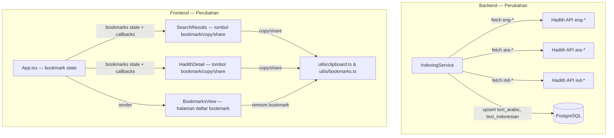
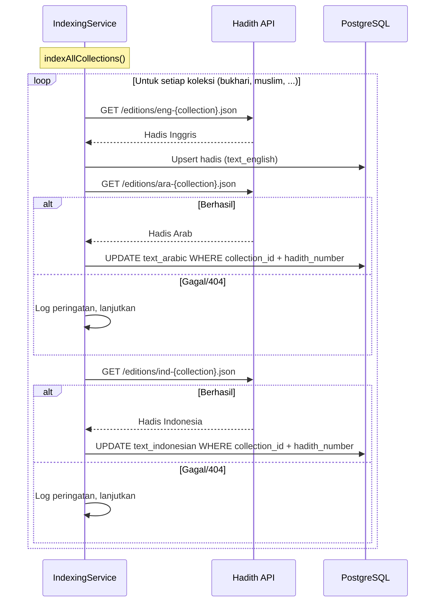
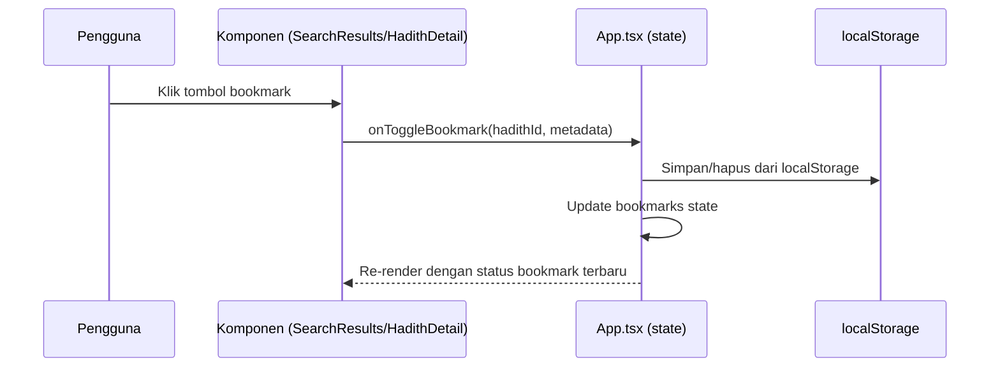

# Dokumen Desain: Hadith Enhancements

## Ikhtisar

Dokumen ini menjelaskan desain peningkatan fitur pada website pencarian hadis semantik yang sudah ada. Peningkatan mencakup lima area:

1. **Indexing multi-bahasa** — Memperluas `IndexingService` agar mengambil edisi Arab (`ara-*`) dan Indonesia (`ind-*`) dari Hadith API fawazahmed0, lalu menyimpan teks ke field `text_arabic` dan `text_indonesian` pada record hadis yang sudah ada di PostgreSQL.
2. **Bookmark hadis** — Fitur client-side menggunakan `localStorage` untuk menyimpan/menghapus hadis favorit, dengan state global yang tersedia di seluruh komponen.
3. **Berbagi hadis (Share)** — Menggunakan Web Share API (jika tersedia) dan fallback ke Clipboard API untuk berbagi teks hadis terformat.
4. **Salin cepat (Quick Copy)** — Tombol satu klik untuk menyalin teks hadis ke clipboard dengan konfirmasi visual sementara.

Semua perubahan dibangun di atas arsitektur yang sudah ada. Tidak ada perubahan pada skema database, model embedding, atau alur pencarian semantik. Backend hanya berubah di `IndexingService` (menambah pengambilan edisi Arab dan Indonesia). Frontend mendapat komponen dan utilitas baru untuk bookmark, share, dan copy.

## Arsitektur

### Perubahan pada Arsitektur Existing



### Alur Indexing Multi-Bahasa



### Alur Bookmark (Frontend)



## Komponen dan Antarmuka

### Komponen Backend yang Diubah

#### IndexingService (backend/src/services/indexingService.ts)

Perubahan utama: menambah `EDITION_MAP` untuk edisi Arab dan Indonesia, serta method baru `indexLanguageEditions()` yang dipanggil setelah indexing Inggris selesai per koleksi.

```pascal
INTERFACE IndexingService (perubahan)
  -- Existing
  indexAllCollections(): IndexingReport
  indexCollection(collectionId, collectionName): Number

  -- Baru (private)
  indexLanguageEdition(collectionId, languagePrefix, fieldName): Number
    -- Mengambil edisi bahasa tertentu dan update field yang sesuai
    -- languagePrefix: "ara" | "ind"
    -- fieldName: "text_arabic" | "text_indonesian"
    -- Return: jumlah hadis yang berhasil di-update
END INTERFACE
```

#### HadithRepository (backend/src/repositories/hadithRepository.ts)

Menambah method untuk update field bahasa tertentu:

```pascal
INTERFACE HadithRepository (perubahan)
  -- Baru
  updateLanguageText(collectionId, hadithNumber, fieldName, text): Boolean
    -- Update satu field bahasa pada hadis yang cocok
    -- Return: true jika record ditemukan dan di-update
END INTERFACE
```

### Komponen Frontend Baru

#### utils/bookmarks.ts

```pascal
INTERFACE BookmarkStorage
  STRUCTURE BookmarkEntry
    hadithId: String
    collectionName: String
    hadithNumber: Number
    textPreview: String        -- Cuplikan 150 karakter pertama
    savedAt: String            -- ISO timestamp
  END STRUCTURE

  getBookmarks(): BookmarkEntry[]
  addBookmark(entry: BookmarkEntry): VOID
  removeBookmark(hadithId: String): VOID
  isBookmarked(hadithId: String): Boolean
END INTERFACE
```

#### utils/clipboard.ts

```pascal
INTERFACE ClipboardUtils
  formatHadithText(hadith: Hadith): String
    -- Format: "{collection_name} — Hadith #{number}\n\n{arabic}\n\n{english}\n\n{indonesian}\n\nRef: {reference}"

  copyToClipboard(text: String): Promise<Boolean>
    -- Wrapper navigator.clipboard.writeText, return success/failure

  shareHadith(hadith: Hadith): Promise<VOID>
    -- Gunakan navigator.share jika tersedia, fallback ke copyToClipboard
END INTERFACE
```

#### BookmarksView (frontend/src/components/BookmarksView.tsx)

```pascal
INTERFACE BookmarksView
  Props:
    bookmarks: BookmarkEntry[]
    onRemoveBookmark(hadithId: String): VOID
    onSelectHadith(hadithId: String): VOID

  -- Menampilkan daftar bookmark dengan tombol hapus dan navigasi ke detail
END INTERFACE
```

### Komponen Frontend yang Diubah

#### App.tsx

Perubahan:
- Menambah state `bookmarks: BookmarkEntry[]` yang dimuat dari localStorage saat init
- Menambah view `"bookmarks"` pada type `View`
- Menambah callback `handleToggleBookmark`, `handleRemoveBookmark`
- Menambah tombol navigasi ke halaman bookmark di header
- Meneruskan props bookmark ke `SearchResults`, `HadithDetail`, dan `BookmarksView`

#### SearchResults.tsx

Perubahan:
- Menerima props baru: `bookmarks`, `onToggleBookmark`, `onCopyHadith`, `onShareHadith`
- Menambah tombol bookmark, copy, dan share pada setiap result card
- Tombol bookmark menampilkan ikon berbeda jika sudah di-bookmark

#### HadithDetail.tsx

Perubahan:
- Menerima props baru: `isBookmarked`, `onToggleBookmark`, `onCopyHadith`, `onShareHadith`
- Menambah tombol bookmark, copy, dan share di header detail

## Model Data

### BookmarkEntry (Frontend — localStorage)

```pascal
STRUCTURE BookmarkEntry
  hadithId: String              -- UUID hadis
  collectionName: String        -- Nama koleksi (e.g. "Sahih al-Bukhari")
  hadithNumber: Number          -- Nomor hadis
  textPreview: String           -- 150 karakter pertama teks hadis
  savedAt: String               -- ISO 8601 timestamp
END STRUCTURE
```

**Aturan Validasi**:
- `hadithId` harus non-empty string
- `hadithNumber` harus bilangan positif
- `textPreview` maksimal 150 karakter
- `savedAt` harus ISO 8601 valid

**Penyimpanan**: Array `BookmarkEntry[]` diserialisasi sebagai JSON di `localStorage` dengan key `"hadith-bookmarks"`.

### Perubahan pada Model Existing

Tidak ada perubahan pada skema database PostgreSQL. Field `text_arabic` dan `text_indonesian` sudah ada di tabel `hadiths` (saat ini berisi string kosong). Indexing multi-bahasa hanya mengisi field yang sudah ada.

### EDITION_MAP Baru (Backend)

```pascal
-- Map tambahan untuk edisi Arab dan Indonesia
CONSTANT ARABIC_EDITION_MAP
  "ara-bukhari"  → collectionId: "bukhari"
  "ara-muslim"   → collectionId: "muslim"
  "ara-abudawud" → collectionId: "abudawud"
  "ara-tirmidhi" → collectionId: "tirmidhi"
  "ara-nasai"    → collectionId: "nasai"
  "ara-ibnmajah" → collectionId: "ibnmajah"
  "ara-malik"    → collectionId: "malik"

CONSTANT INDONESIAN_EDITION_MAP
  "ind-bukhari"  → collectionId: "bukhari"
  "ind-muslim"   → collectionId: "muslim"
  "ind-abudawud" → collectionId: "abudawud"
  "ind-tirmidhi" → collectionId: "tirmidhi"
  "ind-nasai"    → collectionId: "nasai"
  "ind-ibnmajah" → collectionId: "ibnmajah"
  "ind-malik"    → collectionId: "malik"
```


## Correctness Properties

*Properti kebenaran (correctness property) adalah karakteristik atau perilaku yang harus berlaku di semua eksekusi valid dari sebuah sistem — pada dasarnya, pernyataan formal tentang apa yang seharusnya dilakukan sistem. Properti berfungsi sebagai jembatan antara spesifikasi yang dapat dibaca manusia dan jaminan kebenaran yang dapat diverifikasi mesin.*

### Property 1: Pengambilan Edisi Bahasa

*Untuk setiap* koleksi yang didukung (bukhari, muslim, abudawud, tirmidhi, nasai, ibnmajah, malik) dan *untuk setiap* prefix bahasa (ara, ind), ketika `indexAllCollections()` dijalankan, `IndexingService` harus mencoba mengambil edisi `{prefix}-{collection}` dari Hadith API.

**Validates: Requirements 1.1, 2.1**

### Property 2: Penyimpanan Teks Bahasa yang Benar

*Untuk setiap* hadis yang berhasil diambil dari edisi bahasa tertentu (Arab atau Indonesia), teks tersebut harus tersimpan di field yang benar (`text_arabic` untuk edisi `ara-*`, `text_indonesian` untuk edisi `ind-*`) pada record hadis yang cocok berdasarkan `(collection_id, hadith_number)`.

**Validates: Requirements 1.2, 1.4, 2.2, 2.4**

### Property 3: Idempoten Indexing Bahasa

*Untuk setiap* koleksi, menjalankan indexing bahasa (Arab/Indonesia) dua kali berturut-turut harus menghasilkan data yang identik — jumlah record tidak bertambah dan nilai field `text_arabic`/`text_indonesian` tetap sama.

**Validates: Requirements 1.5, 2.5**

### Property 4: Bookmark Round-Trip

*Untuk setiap* hadis dengan ID dan metadata valid, menambahkan hadis ke bookmark lalu menghapusnya harus mengembalikan daftar bookmark ke keadaan semula (tanpa entry tersebut). Sebaliknya, menambahkan hadis yang belum ada di bookmark harus menambah panjang daftar bookmark tepat satu.

**Validates: Requirements 3.1, 3.3, 3.5**

### Property 5: Konsistensi Query Bookmark

*Untuk setiap* set operasi bookmark (add/remove), fungsi `isBookmarked(hadithId)` harus mengembalikan `true` jika dan hanya jika hadis tersebut ada di daftar bookmark saat ini. Fungsi `getBookmarks()` harus mengembalikan tepat semua entry yang telah ditambahkan dan belum dihapus.

**Validates: Requirements 3.2, 3.4**

### Property 6: Serialisasi Bookmark Round-Trip

*Untuk setiap* daftar bookmark yang valid, menyimpan ke `localStorage` lalu memuat kembali harus menghasilkan daftar yang identik (sama isi, sama urutan).

**Validates: Requirements 3.7**

### Property 7: Kelengkapan Format Teks Hadis

*Untuk setiap* hadis yang memiliki minimal satu field teks terisi, hasil `formatHadithText(hadith)` harus mengandung: nama koleksi, nomor hadis, semua teks yang tersedia (Arab jika `text_arabic` tidak kosong, Inggris jika `text_english` tidak kosong, Indonesia jika `text_indonesian` tidak kosong), dan referensi.

**Validates: Requirements 4.2, 4.3, 5.3**

## Error Handling

### Backend — IndexingService

| Skenario | Penanganan |
|----------|------------|
| Fetch edisi bahasa gagal (404/network error) | Log peringatan `[IndexingService] Warning: {lang} edition for {collection} not available`, lanjutkan ke koleksi/bahasa berikutnya. Tidak menghentikan proses indexing. Error dicatat di `IndexingReport.errors`. |
| Hadis dari edisi bahasa tidak cocok dengan record existing | Skip hadis tersebut (log debug). Tidak membuat record baru — hanya update record yang sudah ada. |
| Database connection error saat update | Throw error, dicatat di `IndexingReport.errors` untuk koleksi tersebut, lanjutkan ke koleksi berikutnya. |

### Frontend — Bookmark

| Skenario | Penanganan |
|----------|------------|
| `localStorage` tidak tersedia | Tangkap exception, tampilkan toast/banner error: "Penyimpanan lokal tidak tersedia. Fitur bookmark tidak dapat digunakan." Bookmark state tetap kosong. |
| `localStorage` penuh (QuotaExceededError) | Tangkap exception, tampilkan pesan: "Penyimpanan lokal penuh. Hapus beberapa bookmark untuk menambah yang baru." |
| Data bookmark di localStorage corrupt (JSON parse error) | Reset ke array kosong, log warning ke console. |

### Frontend — Clipboard/Share

| Skenario | Penanganan |
|----------|------------|
| `navigator.clipboard.writeText()` gagal | Tangkap exception, tampilkan pesan error sementara: "Gagal menyalin teks. Coba lagi." |
| `navigator.share()` gagal (user cancel atau error) | Jika `AbortError` (user cancel), abaikan. Untuk error lain, fallback ke copy to clipboard. |
| `navigator.share` tidak tersedia | Sembunyikan tombol "Bagikan", hanya tampilkan "Salin ke Clipboard". Deteksi via `typeof navigator.share === 'function'`. |

## Testing Strategy

### Pendekatan Pengujian Ganda

Pengujian menggunakan dua pendekatan komplementer:

1. **Unit tests** — Memverifikasi contoh spesifik, edge case, dan kondisi error
2. **Property-based tests** — Memverifikasi properti universal di semua input yang valid

### Library dan Konfigurasi

- **Backend**: Vitest + [fast-check](https://github.com/dubzzz/fast-check) untuk property-based testing
- **Frontend**: Vitest + fast-check + React Testing Library
- Setiap property test dikonfigurasi dengan minimum **100 iterasi**
- Setiap property test diberi tag komentar: `Feature: hadith-enhancements, Property {number}: {judul}`

### Property-Based Tests

Setiap correctness property di atas diimplementasikan sebagai **satu** property-based test:

| Property | Test | Generator |
|----------|------|-----------|
| Property 1: Pengambilan Edisi Bahasa | Verifikasi bahwa untuk koleksi dan bahasa acak, fetch URL yang benar terbentuk | `fc.constantFrom(...collections)` × `fc.constantFrom("ara", "ind")` |
| Property 2: Penyimpanan Teks Bahasa | Untuk hadis acak dengan nomor dan koleksi acak, setelah `indexLanguageEdition`, field yang benar terisi | `fc.record({hadithNumber: fc.integer({min:1}), text: fc.string({minLength:1}), collectionId: fc.constantFrom(...)})` |
| Property 3: Idempoten Indexing | Jalankan indexing dua kali, bandingkan state database | `fc.constantFrom(...collections)` |
| Property 4: Bookmark Round-Trip | Untuk ID dan metadata acak, add lalu remove menghasilkan state awal | `fc.record({hadithId: fc.uuid(), collectionName: fc.string(), hadithNumber: fc.integer({min:1}), textPreview: fc.string({maxLength:150})})` |
| Property 5: Konsistensi Query Bookmark | Untuk sequence operasi add/remove acak, isBookmarked konsisten | `fc.array(fc.record({op: fc.constantFrom("add","remove"), hadithId: fc.uuid()}))` |
| Property 6: Serialisasi Bookmark Round-Trip | Untuk array BookmarkEntry acak, JSON.stringify lalu JSON.parse menghasilkan data identik | `fc.array(bookmarkEntryArbitrary)` |
| Property 7: Kelengkapan Format Teks | Untuk hadis acak dengan kombinasi field terisi/kosong, output mengandung semua field yang terisi | `fc.record({collection_name: fc.string({minLength:1}), hadith_number: fc.integer({min:1}), text_arabic: fc.oneof(fc.constant(""), fc.string({minLength:1})), ...})` |

### Unit Tests

Unit test fokus pada:

- **Edge cases**: localStorage tidak tersedia, clipboard API gagal, fetch 404 untuk edisi bahasa
- **Contoh spesifik**: Format teks hadis dengan hanya teks Arab, hanya Inggris, semua bahasa tersedia
- **Integrasi UI**: Tombol bookmark berubah tampilan saat di-toggle, konfirmasi copy muncul 2 detik
- **Feature detection**: Web Share API tersedia vs tidak tersedia
- **Error handling**: QuotaExceededError pada localStorage, AbortError pada share
