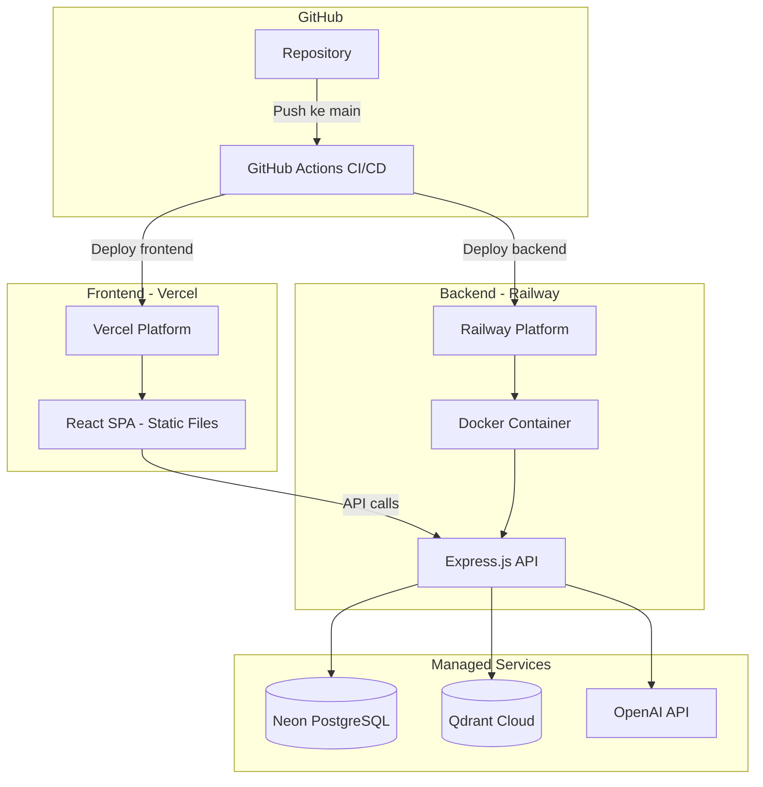
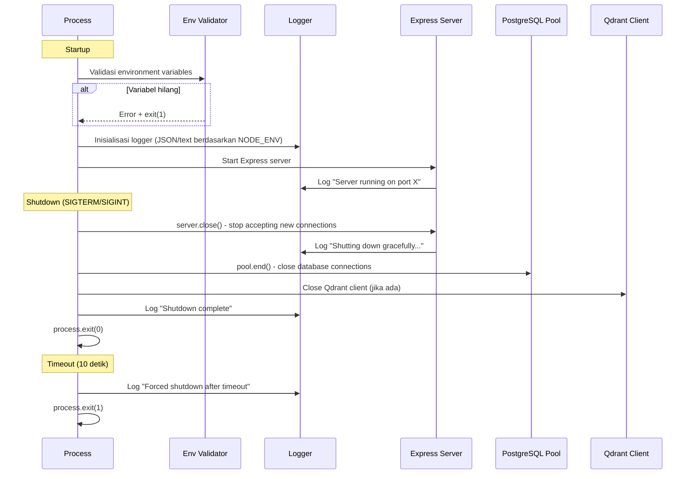

# Dokumen Desain: Production Deployment

## Ikhtisar

Dokumen ini menjelaskan desain teknis untuk menjadikan aplikasi Semantic Hadith Search (backend Express.js + frontend React/Vite) siap produksi dan di-deploy ke platform cloud. Cakupan meliputi: konfigurasi Docker, deployment ke Vercel (frontend) dan Railway (backend), pipeline CI/CD dengan GitHub Actions, structured logging, graceful shutdown, health check yang komprehensif, penguatan keamanan (CORS, validasi environment), SEO/meta tags, error boundary, dan optimasi performa.

Aplikasi saat ini sudah berfungsi secara lokal. Desain ini fokus pada file-file baru yang perlu dibuat dan modifikasi pada file-file yang sudah ada agar layak untuk deployment produksi.

## Arsitektur

### Diagram Arsitektur Deployment



### Diagram Alur Startup dan Shutdown Backend



### Strategi Deployment

| Komponen | Platform | Metode | Trigger |
|----------|----------|--------|---------|
| Frontend | Vercel | Git integration + `vercel.json` | Push ke `main` |
| Backend | Railway | Docker build dari `Dockerfile` | Push ke `main` via GitHub Actions |
| Database | Neon | Managed PostgreSQL | Manual setup |
| Vector DB | Qdrant Cloud | Managed Qdrant | Manual setup |

## Komponen dan Antarmuka

### File Baru yang Perlu Dibuat

#### 1. `backend/Dockerfile` — Multi-stage Docker Build

Dockerfile multi-stage untuk menghasilkan image produksi yang ringan.

```
Stage 1 (build): node:22-alpine → install deps → tsc compile
Stage 2 (runtime): node:22-alpine → copy dist + prod deps → run as non-root user
```

Antarmuka:
- Input: Source code TypeScript di `backend/src/`
- Output: Docker image < 300MB dengan `node dist/index.js` sebagai entrypoint
- User: non-root (`node` user bawaan Alpine)

#### 2. `backend/.dockerignore`

Mengabaikan file yang tidak diperlukan dalam Docker build context: `node_modules/`, `dist/`, `.env`, `*.test.ts`, `vitest.config.ts`.

#### 3. `backend/railway.json` — Konfigurasi Railway

```json
{
  "$schema": "https://railway.com/railway.schema.json",
  "build": { "builder": "DOCKERFILE", "dockerfilePath": "Dockerfile" },
  "deploy": { "healthcheckPath": "/api/health", "healthcheckTimeout": 30 }
}
```

#### 4. `frontend/vercel.json` — Konfigurasi Vercel

Konfigurasi SPA routing (rewrite semua path ke `index.html`) dan build settings.

```json
{
  "buildCommand": "npm run build",
  "outputDirectory": "dist",
  "rewrites": [{ "source": "/(.*)", "destination": "/index.html" }]
}
```

#### 5. `.github/workflows/ci.yml` — GitHub Actions CI/CD Pipeline

Workflow yang menjalankan lint, type check, test, dan build untuk backend dan frontend pada setiap pull request ke `main`. Menggunakan cache `node_modules` untuk mempercepat pipeline.

#### 6. `backend/src/utils/logger.ts` — Structured Logger

Module logger yang menghasilkan output berbeda berdasarkan `NODE_ENV`:
- Production: JSON terstruktur `{ timestamp, level, message, requestId, ...meta }`
- Development: Format teks yang mudah dibaca

Antarmuka:
```pascal
INTERFACE Logger
  info(message: String, meta?: Object): VOID
  warn(message: String, meta?: Object): VOID
  error(message: String, meta?: Object): VOID
END INTERFACE
```

#### 7. `backend/src/middleware/requestId.ts` — Request ID Middleware

Middleware yang menghasilkan UUID v4 untuk setiap request dan menyimpannya di `res.locals.requestId` serta menambahkan header `X-Request-Id`.

#### 8. `backend/src/middleware/requestLogger.ts` — Request Logger Middleware

Middleware yang mencatat setiap request HTTP: method, path, status code, response time (ms), dan request ID.

#### 9. `backend/src/utils/validateEnv.ts` — Environment Variable Validator

Fungsi yang memvalidasi keberadaan environment variable wajib saat startup: `DATABASE_URL`, `QDRANT_URL`, `OPENAI_API_KEY`. Jika ada yang hilang, tampilkan pesan error yang jelas dan exit(1).

Antarmuka:
```pascal
PROCEDURE validateEnv(): VOID
  -- Throws/exits jika variabel wajib tidak ada
  -- Mengembalikan void jika semua valid
END PROCEDURE
```

#### 10. `frontend/src/components/ErrorBoundary.tsx` — React Error Boundary

Komponen class-based yang menangkap error rendering di child tree dan menampilkan fallback UI dengan pesan ramah dan tombol reload.

### File yang Perlu Dimodifikasi

#### 1. `backend/src/index.ts` — Modifikasi Utama

Perubahan yang diperlukan:
- Import dan panggil `validateEnv()` di awal sebelum server start
- Tambahkan middleware `requestId` dan `requestLogger`
- Tambahkan compression middleware (`compression`)
- Ubah CORS config untuk membaca `ALLOWED_ORIGINS` (dipisah koma)
- Fallback ke `http://localhost:5173` jika `NODE_ENV=development` dan `ALLOWED_ORIGINS` tidak diset
- Tolak origin yang tidak diizinkan dengan status 403
- Perkaya health check endpoint: cek koneksi PostgreSQL dan Qdrant, kembalikan status `ok`/`degraded`/`error`
- Implementasi graceful shutdown (SIGTERM/SIGINT): stop server, tunggu request aktif, tutup pool DB, timeout 10 detik
- Ubah error handler global: format konsisten `{ error, requestId, statusCode }`, sembunyikan stack trace di production
- Simpan referensi `server` dari `app.listen()` untuk graceful shutdown

#### 2. `frontend/index.html` — SEO dan Meta Tags

Perubahan:
- Ubah `<html lang="en">` menjadi `<html lang="id">`
- Ubah `<title>` menjadi deskriptif
- Tambahkan meta `description`
- Tambahkan meta Open Graph (`og:title`, `og:description`, `og:type`, `og:url`, `og:image`)
- Tambahkan meta Twitter Card (`twitter:card`, `twitter:title`, `twitter:description`, `twitter:image`)

#### 3. `frontend/src/App.tsx` — Error Boundary Wrapper

Bungkus root app dengan `<ErrorBoundary>` component.

#### 4. `frontend/src/main.tsx` — Error Boundary di Level Root

Alternatif: bungkus `<App />` dengan `<ErrorBoundary>` di entry point.

#### 5. `.gitignore` (root) — Buat atau Perbarui

Tambahkan pattern: `node_modules/`, `dist/`, `.env`, `.env.*`, `*.log`, `.DS_Store`, `Thumbs.db`.

#### 6. `README.md` (root) — Dokumentasi Proyek

Buat file README.md dengan: deskripsi proyek, arsitektur, prerequisites, instruksi setup lokal, daftar endpoint API, instruksi deployment.

#### 7. `LICENSE` (root) — Lisensi Open Source

File lisensi MIT.

#### 8. `frontend/public/manifest.json` — PWA Manifest

File manifest dengan `name`, `short_name`, `description`, `start_url`, `display`, `theme_color`, `background_color`, dan referensi ikon.

## Model Data

### HealthCheckResponse

```pascal
STRUCTURE HealthCheckResponse
  status: "ok" | "degraded" | "error"   -- Status keseluruhan
  services: ServiceStatus               -- Status per layanan
  timestamp: String                     -- ISO 8601 timestamp
END STRUCTURE

STRUCTURE ServiceStatus
  database: "connected" | "disconnected"    -- Status PostgreSQL
  vectorDb: "connected" | "disconnected"    -- Status Qdrant
END STRUCTURE
```

Aturan:
- `status = "ok"` jika semua services `connected`
- `status = "degraded"` jika salah satu service `disconnected`
- `status = "error"` jika semua services `disconnected`

### ErrorResponse

```pascal
STRUCTURE ErrorResponse
  error: String          -- Pesan error yang aman untuk client
  requestId: String      -- UUID v4 request ID
  statusCode: Number     -- HTTP status code (4xx atau 5xx)
END STRUCTURE
```

Aturan:
- Di production, `error` TIDAK BOLEH mengandung stack trace, path file, atau nama environment variable
- `requestId` selalu disertakan untuk korelasi dengan log

### RequestLogEntry

```pascal
STRUCTURE RequestLogEntry
  timestamp: String      -- ISO 8601
  level: "info" | "warn" | "error"
  message: String
  requestId: String      -- UUID v4
  method: String         -- HTTP method (GET, POST, dll)
  path: String           -- Request path
  statusCode: Number     -- Response status code
  responseTimeMs: Number -- Waktu pemrosesan dalam milidetik
END STRUCTURE
```

### EnvironmentConfig

```pascal
STRUCTURE EnvironmentConfig
  NODE_ENV: "development" | "staging" | "production"
  DATABASE_URL: String        -- Wajib
  QDRANT_URL: String          -- Wajib
  OPENAI_API_KEY: String      -- Wajib
  ALLOWED_ORIGINS: String     -- Opsional, dipisah koma
  PORT: Number                -- Opsional, default 3000
  REDIS_URL: String           -- Opsional
END STRUCTURE
```

Aturan validasi:
- `DATABASE_URL`, `QDRANT_URL`, `OPENAI_API_KEY` wajib ada saat startup
- Jika salah satu hilang, proses harus exit(1) dengan pesan yang menyebutkan nama variabel

## Correctness Properties

*Sebuah property adalah karakteristik atau perilaku yang harus berlaku di semua eksekusi valid dari sebuah sistem — pada dasarnya, pernyataan formal tentang apa yang seharusnya dilakukan sistem. Property berfungsi sebagai jembatan antara spesifikasi yang dapat dibaca manusia dan jaminan kebenaran yang dapat diverifikasi mesin.*

### Property 1: Format log ditentukan oleh NODE_ENV

*For any* pesan log dan nilai NODE_ENV, jika NODE_ENV bernilai `production` maka output log harus berupa JSON valid yang mengandung field `timestamp`, `level`, `message`, dan `requestId`. Jika NODE_ENV bernilai `development` maka output log harus berupa teks non-JSON yang mudah dibaca.

**Validates: Requirements 2.2, 2.3**

### Property 2: Komputasi status health check

*For any* kombinasi status koneksi PostgreSQL (connected/disconnected) dan Qdrant (connected/disconnected), health check endpoint harus mengembalikan: `status = "ok"` jika keduanya connected, `status = "degraded"` jika salah satu disconnected, dan `status = "error"` jika keduanya disconnected. Response harus selalu mengandung field `status` dan `services` dengan sub-field `database` dan `vectorDb`.

**Validates: Requirements 2.4, 5.5, 5.6**

### Property 3: Error Boundary menangkap error child component

*For any* error yang dilempar oleh child component di dalam React tree, ErrorBoundary harus menangkap error tersebut dan merender fallback UI yang mengandung pesan error ramah dan tombol reload, tanpa membiarkan error menyebar ke luar boundary.

**Validates: Requirements 4.4**

### Property 4: Kelengkapan field log request

*For any* HTTP request yang masuk ke backend, log entry yang dihasilkan harus mengandung field: `method`, `path`, `statusCode`, `responseTimeMs` (bertipe number >= 0), dan `requestId` (bertipe string non-kosong).

**Validates: Requirements 5.1, 10.4, 11.4**

### Property 5: Request ID berformat UUID v4 dan unik

*For any* dua HTTP request yang berbeda, masing-masing harus mendapatkan Request ID yang berbeda, dan setiap Request ID harus sesuai dengan format UUID v4 (regex: `/^[0-9a-f]{8}-[0-9a-f]{4}-4[0-9a-f]{3}-[89ab][0-9a-f]{3}-[0-9a-f]{12}$/i`). Request ID juga harus disertakan di response header `X-Request-Id`.

**Validates: Requirements 5.2**

### Property 6: Format error response konsisten

*For any* error response (status code 4xx atau 5xx) dari backend, response body harus mengandung tepat tiga field: `error` (string), `requestId` (string UUID v4), dan `statusCode` (number yang sama dengan HTTP status code).

**Validates: Requirements 5.3**

### Property 7: Sanitasi error di production

*For any* error response yang dihasilkan saat `NODE_ENV = production`, field `error` dalam response body tidak boleh mengandung stack trace (tidak ada baris yang mengandung `at ` diikuti path file), path file sistem (tidak ada `/` atau `\` yang menunjuk ke file), atau nama environment variable (tidak ada string yang cocok dengan pattern `[A-Z_]{3,}=`).

**Validates: Requirements 5.4, 11.3**

### Property 8: Validasi CORS origin

*For any* HTTP request dengan header `Origin`, jika origin tersebut ada dalam daftar `ALLOWED_ORIGINS` (dipisah koma dari environment variable), maka request harus diizinkan. Jika origin tidak ada dalam daftar, request harus ditolak dengan status 403. Khusus saat `NODE_ENV = development` dan `ALLOWED_ORIGINS` tidak diset, origin `http://localhost:5173` harus diizinkan secara default.

**Validates: Requirements 6.1, 6.2, 6.3**

### Property 9: Validasi environment variable saat startup

*For any* subset dari environment variable wajib (`DATABASE_URL`, `QDRANT_URL`, `OPENAI_API_KEY`) yang tidak diset, fungsi validasi harus mengembalikan error yang menyebutkan nama setiap variabel yang hilang. Jika semua variabel wajib diset, fungsi harus berhasil tanpa error.

**Validates: Requirements 11.1, 11.2**

### Property 10: Kompresi response besar

*For any* HTTP response dari backend dengan body lebih besar dari 1KB, jika client mengirim header `Accept-Encoding: gzip`, maka response harus dikompresi (header `Content-Encoding: gzip` harus ada) dan ukuran response terkompresi harus lebih kecil dari ukuran asli.

**Validates: Requirements 10.1**

## Error Handling

### Strategi Error Handling Backend

| Skenario | Penanganan | Status Code | Log Level |
|----------|-----------|-------------|-----------|
| Validasi input gagal | Return error message spesifik | 400 | warn |
| Resource tidak ditemukan | Return "not found" | 404 | info |
| CORS origin tidak diizinkan | Tolak request | 403 | warn |
| Rate limit terlampaui | Return "too many requests" | 429 | warn |
| Koneksi DB terputus | Return "service unavailable", update health check | 503 | error |
| Koneksi Qdrant terputus | Return "service unavailable", update health check | 503 | error |
| OpenAI API error | Return "service unavailable" | 503 | error |
| Unhandled exception | Return generic error, log detail | 500 | error |
| Env variable hilang saat startup | Log error, exit(1) | N/A | error |
| Graceful shutdown timeout | Force exit(1) | N/A | error |

### Format Error Response

Semua error response (4xx dan 5xx) menggunakan format konsisten:

```json
{
  "error": "Pesan error yang aman untuk client",
  "requestId": "uuid-v4-string",
  "statusCode": 400
}
```

Di production (`NODE_ENV=production`):
- Stack trace TIDAK disertakan
- Path file sistem TIDAK disertakan
- Nama environment variable TIDAK disertakan
- Hanya pesan error generik yang dikirim ke client

Di development:
- Stack trace boleh disertakan untuk debugging
- Detail error lebih lengkap

### Error Handling Frontend

- `ErrorBoundary` di level root menangkap error rendering React
- Fallback UI menampilkan pesan ramah: "Terjadi kesalahan. Silakan muat ulang halaman."
- Tombol "Muat Ulang" yang memanggil `window.location.reload()`
- Error state di `App.tsx` menampilkan banner error untuk error API (sudah ada)

## Testing Strategy

### Pendekatan Dual Testing

Testing menggunakan dua pendekatan komplementer:

1. **Unit Tests**: Memverifikasi contoh spesifik, edge case, dan kondisi error
2. **Property-Based Tests**: Memverifikasi properti universal di semua input menggunakan library `fast-check` (sudah ada di devDependencies backend)

### Property-Based Testing

Library: `fast-check` (sudah terinstall di backend)
Konfigurasi: Minimum 100 iterasi per property test

Setiap property test harus di-tag dengan komentar yang mereferensikan property di dokumen desain:

```typescript
// Feature: production-deployment, Property 1: Format log ditentukan oleh NODE_ENV
```

Setiap correctness property di atas HARUS diimplementasikan oleh SATU property-based test.

### Unit Tests

Unit test fokus pada:
- Contoh spesifik: health check mengembalikan `ok` saat semua service connected
- Edge case: graceful shutdown timeout setelah 10 detik
- Integrasi: middleware chain (requestId → requestLogger → route handler → error handler)
- File existence: vercel.json, Dockerfile, .dockerignore, railway.json, manifest.json
- HTML content: meta tags, title, lang attribute

### Test Files yang Perlu Dibuat

| File | Cakupan |
|------|---------|
| `backend/src/utils/logger.test.ts` | Property 1: format log berdasarkan NODE_ENV |
| `backend/src/utils/validateEnv.test.ts` | Property 9: validasi env variable |
| `backend/src/middleware/requestId.test.ts` | Property 5: UUID v4 format dan uniqueness |
| `backend/src/middleware/requestLogger.test.ts` | Property 4: kelengkapan field log |
| `backend/src/routes/health.test.ts` | Property 2: komputasi status health check |
| `backend/src/middleware/cors.test.ts` | Property 8: validasi CORS origin |
| `backend/src/middleware/errorHandler.test.ts` | Property 6, 7: format error dan sanitasi |
| `frontend/src/components/ErrorBoundary.test.tsx` | Property 3: error boundary |

### Catatan Penting

- Property test untuk kompresi (Property 10) memerlukan supertest untuk mengirim request dengan header `Accept-Encoding`
- Property test untuk CORS (Property 8) memerlukan supertest untuk mengirim request dengan header `Origin`
- Frontend property test (Property 3) memerlukan testing library React (`@testing-library/react`)
- Semua property test backend menggunakan `fast-check` dengan `fc.assert(fc.property(...), { numRuns: 100 })`
