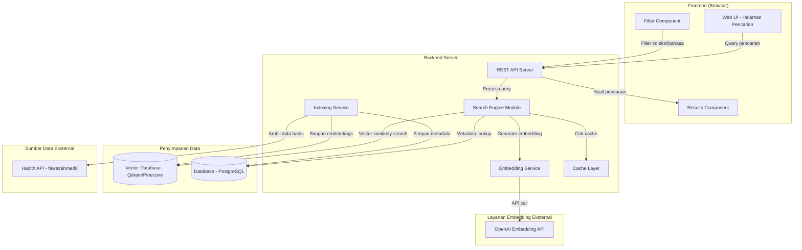
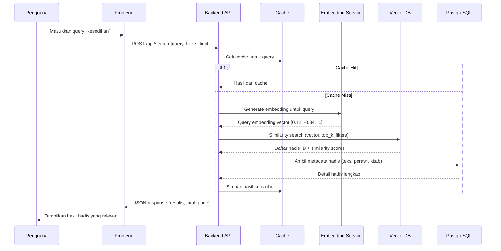
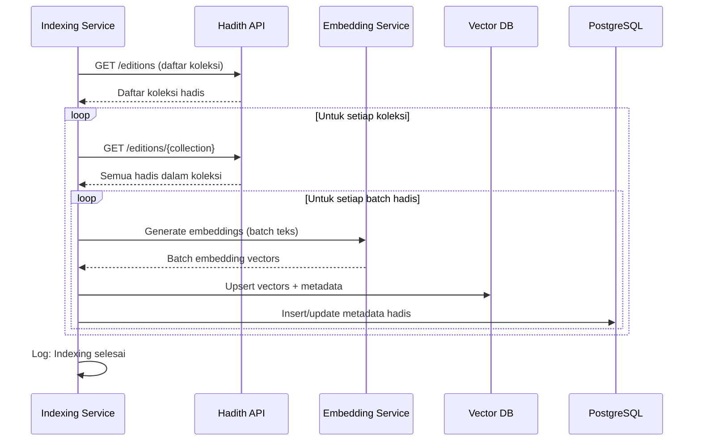

# Dokumen Desain: Semantic Hadith Search

## Ikhtisar

Website pencarian hadis semantik ini memungkinkan pengguna untuk mencari hadis dari kitab-kitab hadis utama (Kutub al-Sittah dan koleksi lainnya) menggunakan pencarian berbasis makna (semantic search), bukan hanya pencocokan kata kunci secara persis. Sistem ini menggunakan teknik embedding teks dan vector similarity search untuk menemukan hadis yang relevan secara tematik.

Sebagai contoh, ketika pengguna mencari "kesedihan", sistem tidak hanya mencari hadis yang mengandung kata "sedih" secara literal, tetapi juga hadis yang membahas tema terkait seperti "duka", "menangis", "musibah", "ujian", dan konsep-konsep yang berkaitan secara semantik. Hal ini dicapai dengan mengubah teks hadis dan query pencarian menjadi vektor numerik (embeddings) dan menghitung kesamaan (similarity) antar vektor tersebut.

Sumber data hadis diperoleh dari API publik yang tersedia, khususnya **Hadith API by fawazahmed0** (tersedia di `cdn.jsdelivr.net/gh/fawazahmed0/hadith-api@1`) yang menyediakan koleksi hadis lengkap dalam berbagai bahasa termasuk Arab dan Indonesia/Inggris. API ini mencakup koleksi utama: Sahih Bukhari, Sahih Muslim, Sunan Abu Dawud, Sunan Tirmidzi, Sunan Nasa'i, Sunan Ibnu Majah, Muwatta Malik, Musnad Ahmad, dan lainnya.

## Arsitektur

### Diagram Arsitektur Sistem



### Diagram Alur Pencarian (Sequence Diagram)



### Diagram Alur Indexing Data



## Komponen dan Antarmuka

### Komponen 1: Frontend Web (UI)

**Tujuan**: Menyediakan antarmuka pengguna untuk pencarian hadis dan menampilkan hasil.

```pascal
INTERFACE FrontendApp
  renderSearchPage(): HTMLPage
  handleSearchInput(query: String): VOID
  displayResults(results: SearchResult[]): VOID
  applyFilters(filters: FilterOptions): VOID
  showHadithDetail(hadithId: String): VOID
  handlePagination(page: Number): VOID
END INTERFACE
```

**Tanggung Jawab**:
- Menampilkan form pencarian dengan input teks
- Menampilkan filter berdasarkan koleksi hadis, bahasa, dan perawi
- Menampilkan hasil pencarian dengan skor relevansi
- Menampilkan detail hadis lengkap (teks Arab, terjemahan, sanad, referensi)
- Mendukung pagination untuk hasil pencarian
- Responsif untuk perangkat mobile dan desktop

### Komponen 2: REST API Server

**Tujuan**: Menangani request dari frontend, mengkoordinasikan pencarian, dan mengembalikan hasil.

```pascal
INTERFACE APIServer
  searchHadith(request: SearchRequest): SearchResponse
  getHadithById(id: String): HadithDetail
  getCollections(): Collection[]
  getHadithByCollection(collectionId: String, page: Number): PaginatedHadith
  healthCheck(): HealthStatus
END INTERFACE
```

**Tanggung Jawab**:
- Menerima dan memvalidasi request pencarian
- Mengkoordinasikan proses embedding dan vector search
- Mengelola cache untuk query yang sering dicari
- Mengembalikan hasil dalam format JSON yang terstruktur
- Rate limiting dan error handling

### Komponen 3: Search Engine Module

**Tujuan**: Inti logika pencarian semantik, mengelola proses dari query hingga hasil.

```pascal
INTERFACE SearchEngine
  search(query: String, filters: FilterOptions, limit: Number): SearchResult[]
  rerank(results: SearchResult[], query: String): SearchResult[]
  buildFilterExpression(filters: FilterOptions): FilterExpression
END INTERFACE
```

**Tanggung Jawab**:
- Mengubah query pengguna menjadi embedding vector
- Melakukan vector similarity search di database vektor
- Menerapkan filter (koleksi, bahasa, perawi)
- Melakukan re-ranking hasil jika diperlukan
- Menggabungkan skor similarity dengan metadata

### Komponen 4: Embedding Service

**Tujuan**: Menghasilkan embedding vector dari teks menggunakan model bahasa.

```pascal
INTERFACE EmbeddingService
  generateEmbedding(text: String): Vector
  generateBatchEmbeddings(texts: String[]): Vector[]
  getModelInfo(): ModelInfo
END INTERFACE
```

**Tanggung Jawab**:
- Menghasilkan embedding vector dari teks query atau hadis
- Mendukung batch processing untuk efisiensi indexing
- Menangani retry dan error dari API embedding eksternal
- Mendukung model multilingual (Arab, Indonesia, Inggris)

### Komponen 5: Indexing Service

**Tujuan**: Mengambil data hadis dari API eksternal dan mengindeksnya ke vector database.

```pascal
INTERFACE IndexingService
  indexAllCollections(): IndexingReport
  indexCollection(collectionId: String): IndexingReport
  reindexHadith(hadithId: String): BOOLEAN
  getIndexingStatus(): IndexingStatus
END INTERFACE
```

**Tanggung Jawab**:
- Mengambil data hadis dari Hadith API (fawazahmed0)
- Memproses dan membersihkan teks hadis
- Menghasilkan embeddings secara batch
- Menyimpan embeddings ke vector database
- Menyimpan metadata ke PostgreSQL
- Melaporkan progres dan status indexing


## Model Data

### Hadith (Hadis)

```pascal
STRUCTURE Hadith
  id: UUID                          -- ID unik internal
  external_id: String               -- ID dari API sumber
  collection_id: String             -- ID koleksi (bukhari, muslim, dll)
  collection_name: String           -- Nama koleksi lengkap
  book_number: Number               -- Nomor kitab/bab
  book_name: String                 -- Nama kitab/bab
  hadith_number: Number             -- Nomor hadis dalam koleksi
  text_arabic: String               -- Teks hadis dalam bahasa Arab
  text_indonesian: String           -- Terjemahan bahasa Indonesia (jika tersedia)
  text_english: String              -- Terjemahan bahasa Inggris
  narrator: String                  -- Perawi utama
  grade: String                     -- Derajat hadis (sahih, hasan, dhaif)
  reference: String                 -- Referensi lengkap
  created_at: Timestamp
  updated_at: Timestamp
END STRUCTURE
```

**Aturan Validasi**:
- `collection_id` harus merujuk ke koleksi yang valid
- `text_arabic` atau `text_english` harus terisi (minimal salah satu)
- `hadith_number` harus bilangan positif
- `grade` harus salah satu dari: "sahih", "hasan", "dhaif", "maudu", "unknown"

### SearchRequest (Permintaan Pencarian)

```pascal
STRUCTURE SearchRequest
  query: String                     -- Teks pencarian dari pengguna
  language: String                  -- Bahasa pencarian ("ar", "id", "en")
  collections: String[]             -- Filter koleksi (kosong = semua)
  grade_filter: String[]            -- Filter derajat hadis
  limit: Number                     -- Jumlah hasil per halaman (default: 20)
  offset: Number                    -- Offset untuk pagination (default: 0)
  min_score: Float                  -- Skor minimum similarity (default: 0.5)
END STRUCTURE
```

**Aturan Validasi**:
- `query` tidak boleh kosong dan maksimal 500 karakter
- `language` harus salah satu dari: "ar", "id", "en"
- `limit` antara 1 dan 100
- `offset` harus >= 0
- `min_score` antara 0.0 dan 1.0

### SearchResult (Hasil Pencarian)

```pascal
STRUCTURE SearchResult
  hadith: Hadith                    -- Data hadis lengkap
  similarity_score: Float           -- Skor kesamaan semantik (0.0 - 1.0)
  matched_language: String          -- Bahasa yang cocok
  highlight_text: String            -- Teks dengan highlight bagian relevan
END STRUCTURE
```

### SearchResponse (Respons Pencarian)

```pascal
STRUCTURE SearchResponse
  results: SearchResult[]           -- Daftar hasil pencarian
  total_count: Number               -- Total hasil yang ditemukan
  query: String                     -- Query asli
  processing_time_ms: Number        -- Waktu pemrosesan dalam milidetik
  page: Number                      -- Halaman saat ini
  total_pages: Number               -- Total halaman
END STRUCTURE
```

### Collection (Koleksi Hadis)

```pascal
STRUCTURE Collection
  id: String                        -- ID koleksi (contoh: "bukhari")
  name: String                      -- Nama lengkap (contoh: "Sahih al-Bukhari")
  name_arabic: String               -- Nama dalam bahasa Arab
  author: String                    -- Nama penulis/pengumpul
  total_hadith: Number              -- Jumlah total hadis
  description: String               -- Deskripsi singkat koleksi
  available_languages: String[]     -- Bahasa yang tersedia
END STRUCTURE
```

### HadithEmbedding (Embedding Hadis)

```pascal
STRUCTURE HadithEmbedding
  id: UUID                          -- ID unik
  hadith_id: UUID                   -- Referensi ke Hadith
  language: String                  -- Bahasa teks yang di-embed
  embedding_vector: Float[]         -- Vektor embedding (dimensi: 1536 untuk OpenAI)
  model_version: String             -- Versi model embedding yang digunakan
  created_at: Timestamp
END STRUCTURE
```

## Sumber Data: API Hadis yang Tersedia

### 1. Hadith API oleh fawazahmed0 (REKOMENDASI UTAMA)

**URL**: `https://cdn.jsdelivr.net/gh/fawazahmed0/hadith-api@1`

**Keunggulan**:
- Gratis dan open-source (tersedia di GitHub)
- Mencakup koleksi hadis utama yang lengkap
- Tersedia dalam berbagai bahasa termasuk Arab dan Inggris
- Data dalam format JSON yang mudah diproses
- Tidak memerlukan API key
- Di-host di CDN (cepat dan reliable)

**Koleksi yang Tersedia**:
| ID Koleksi | Nama | Jumlah Hadis (Perkiraan) |
|------------|------|--------------------------|
| bukhari | Sahih al-Bukhari | ~7,563 |
| muslim | Sahih Muslim | ~7,453 |
| abudawud | Sunan Abu Dawud | ~5,274 |
| tirmidhi | Jami' at-Tirmidzi | ~3,956 |
| nasai | Sunan an-Nasa'i | ~5,758 |
| ibnmajah | Sunan Ibnu Majah | ~4,341 |
| malik | Muwatta Malik | ~1,832 |
| ahmad | Musnad Ahmad | ~28,199 |
| darimi | Sunan ad-Darimi | ~3,367 |

**Endpoint Utama**:
- `GET /editions` — Daftar semua edisi/koleksi
- `GET /editions/{collection-name}` — Semua hadis dalam satu koleksi
- `GET /editions/{collection-name}/{hadith-number}` — Hadis spesifik

**Format Response**:
```pascal
-- Contoh response dari API
STRUCTURE APIHadithResponse
  metadata: APIMetadata
  hadiths: APIHadith[]
END STRUCTURE

STRUCTURE APIHadith
  hadithnumber: Number
  text: String
  grades: Grade[]
  reference: Reference
END STRUCTURE
```

### 2. Sunnah.com API (Alternatif)

**URL**: `https://api.sunnah.com/v1`

**Catatan**: Memerlukan API key (gratis, perlu mendaftar). Menyediakan data yang terstruktur dengan baik termasuk grading hadis. Bisa digunakan sebagai sumber tambahan atau validasi.

### 3. HadithAPI.com (Alternatif)

**URL**: `https://hadithapi.com/api`

**Catatan**: API berbayar dengan tier gratis terbatas. Menyediakan hadis dalam bahasa Arab, Inggris, dan Urdu.

**Keputusan Desain**: Menggunakan **fawazahmed0 Hadith API** sebagai sumber data utama karena gratis, lengkap, open-source, dan tidak memerlukan autentikasi. Data akan di-download dan diindeks secara lokal untuk performa optimal.

## Pseudocode Algoritmik

### Algoritma Utama: Pencarian Semantik

```pascal
ALGORITHM semanticSearch(request)
INPUT: request bertipe SearchRequest
OUTPUT: response bertipe SearchResponse

BEGIN
  -- Precondition: query tidak kosong, limit > 0
  ASSERT request.query <> "" AND request.limit > 0
  
  startTime ← currentTimeMillis()
  
  -- Langkah 1: Cek cache
  cacheKey ← generateCacheKey(request.query, request.collections, request.language)
  cachedResult ← cache.get(cacheKey)
  
  IF cachedResult IS NOT NULL THEN
    RETURN cachedResult
  END IF
  
  -- Langkah 2: Generate embedding dari query pengguna
  queryEmbedding ← embeddingService.generateEmbedding(request.query)
  
  -- Postcondition: embedding harus berupa vektor dengan dimensi yang benar
  ASSERT length(queryEmbedding) = EMBEDDING_DIMENSION
  
  -- Langkah 3: Bangun filter expression
  filterExpr ← buildFilterExpression(request)
  
  -- Langkah 4: Lakukan vector similarity search
  vectorResults ← vectorDB.search(
    vector: queryEmbedding,
    top_k: request.limit * 2,    -- Ambil lebih banyak untuk re-ranking
    filter: filterExpr,
    min_score: request.min_score
  )
  
  -- Langkah 5: Ambil metadata hadis dari database
  hadithIds ← extractIds(vectorResults)
  hadithMap ← database.getHadithByIds(hadithIds)
  
  -- Langkah 6: Gabungkan hasil dan buat SearchResult
  results ← []
  
  FOR EACH vr IN vectorResults DO
    -- Loop Invariant: semua item di results memiliki similarity_score valid
    hadith ← hadithMap[vr.hadith_id]
    
    IF hadith IS NOT NULL THEN
      result ← NEW SearchResult
      result.hadith ← hadith
      result.similarity_score ← vr.score
      result.matched_language ← request.language
      result.highlight_text ← generateHighlight(hadith, request.query)
      
      APPEND result TO results
    END IF
  END FOR
  
  -- Langkah 7: Re-rank dan potong sesuai limit
  results ← rerank(results, request.query)
  results ← results[request.offset .. request.offset + request.limit]
  
  -- Langkah 8: Bangun response
  response ← NEW SearchResponse
  response.results ← results
  response.total_count ← length(vectorResults)
  response.query ← request.query
  response.processing_time_ms ← currentTimeMillis() - startTime
  response.page ← (request.offset / request.limit) + 1
  response.total_pages ← ceil(response.total_count / request.limit)
  
  -- Langkah 9: Simpan ke cache
  cache.set(cacheKey, response, TTL: 3600)
  
  -- Postcondition: response valid dan waktu pemrosesan tercatat
  ASSERT response.results IS NOT NULL
  ASSERT response.processing_time_ms > 0
  
  RETURN response
END
```

**Preconditions**:
- `request.query` tidak kosong dan panjang <= 500 karakter
- `request.limit` antara 1 dan 100
- Embedding service tersedia dan berfungsi
- Vector database terkoneksi dan berisi data yang sudah diindeks

**Postconditions**:
- Response berisi daftar hasil yang terurut berdasarkan relevansi
- Setiap hasil memiliki `similarity_score` antara 0.0 dan 1.0
- `processing_time_ms` mencerminkan waktu pemrosesan aktual
- Hasil disimpan ke cache untuk query berikutnya

**Loop Invariants**:
- Semua item dalam `results` memiliki `similarity_score` yang valid (0.0 - 1.0)
- Semua item dalam `results` merujuk ke hadis yang ada di database

### Algoritma: Indexing Data Hadis

```pascal
ALGORITHM indexAllCollections()
INPUT: (tidak ada - mengambil dari konfigurasi)
OUTPUT: report bertipe IndexingReport

BEGIN
  report ← NEW IndexingReport
  report.start_time ← currentTime()
  report.collections_processed ← 0
  report.total_hadith_indexed ← 0
  report.errors ← []
  
  -- Langkah 1: Ambil daftar koleksi dari API
  collections ← hadithAPI.getEditions()
  
  FOR EACH collection IN collections DO
    -- Loop Invariant: report.collections_processed = jumlah koleksi yang sudah selesai diproses
    TRY
      -- Langkah 2: Ambil semua hadis dari koleksi
      hadiths ← hadithAPI.getHadithsByCollection(collection.id)
      
      -- Langkah 3: Proses dalam batch
      batches ← splitIntoBatches(hadiths, BATCH_SIZE: 100)
      
      FOR EACH batch IN batches DO
        -- Loop Invariant: semua hadis di batch sebelumnya sudah tersimpan di DB dan VectorDB
        
        -- 3a: Bersihkan dan normalisasi teks
        cleanedTexts ← []
        FOR EACH hadith IN batch DO
          cleanedText ← cleanText(hadith.text)
          APPEND cleanedText TO cleanedTexts
        END FOR
        
        -- 3b: Generate embeddings secara batch
        embeddings ← embeddingService.generateBatchEmbeddings(cleanedTexts)
        
        -- 3c: Simpan ke database dan vector DB
        FOR i ← 0 TO length(batch) - 1 DO
          hadithRecord ← mapToHadithRecord(batch[i], collection)
          database.upsert(hadithRecord)
          
          vectorDB.upsert(
            id: hadithRecord.id,
            vector: embeddings[i],
            metadata: {
              collection_id: collection.id,
              language: collection.language,
              hadith_number: batch[i].hadithnumber,
              grade: batch[i].grades[0].grade
            }
          )
        END FOR
        
        report.total_hadith_indexed ← report.total_hadith_indexed + length(batch)
      END FOR
      
      report.collections_processed ← report.collections_processed + 1
      LOG "Koleksi " + collection.name + " selesai diindeks"
      
    CATCH error
      APPEND {collection: collection.id, error: error.message} TO report.errors
      LOG "Error saat mengindeks " + collection.id + ": " + error.message
    END TRY
  END FOR
  
  report.end_time ← currentTime()
  report.duration_seconds ← report.end_time - report.start_time
  
  -- Postcondition: semua koleksi telah diproses (berhasil atau error tercatat)
  ASSERT report.collections_processed + length(report.errors) = length(collections)
  
  RETURN report
END
```

**Preconditions**:
- Hadith API dapat diakses
- Embedding service tersedia
- Vector database dan PostgreSQL terkoneksi
- Konfigurasi batch size dan model embedding sudah diatur

**Postconditions**:
- Semua koleksi telah diproses (berhasil diindeks atau error tercatat)
- Setiap hadis yang berhasil diindeks memiliki embedding di vector DB dan metadata di PostgreSQL
- Report berisi statistik lengkap proses indexing

**Loop Invariants**:
- `report.collections_processed` = jumlah koleksi yang sudah selesai diproses tanpa error
- Semua hadis di batch sebelumnya sudah tersimpan di kedua database

### Algoritma: Pembersihan Teks Hadis

```pascal
ALGORITHM cleanText(rawText)
INPUT: rawText bertipe String
OUTPUT: cleanedText bertipe String

BEGIN
  -- Precondition: rawText tidak null
  ASSERT rawText IS NOT NULL
  
  text ← rawText
  
  -- Langkah 1: Hapus tag HTML jika ada
  text ← removeHTMLTags(text)
  
  -- Langkah 2: Normalisasi karakter Arab (jika teks Arab)
  IF containsArabic(text) THEN
    text ← normalizeArabicDiacritics(text)   -- Normalisasi harakat
    text ← normalizeArabicLetters(text)       -- Normalisasi hamzah, alif, dll
  END IF
  
  -- Langkah 3: Hapus whitespace berlebih
  text ← collapseWhitespace(text)
  text ← trim(text)
  
  -- Langkah 4: Hapus karakter khusus yang tidak relevan
  text ← removeSpecialCharacters(text)
  
  -- Postcondition: teks bersih, tidak kosong (jika input tidak kosong)
  ASSERT length(rawText) > 0 IMPLIES length(text) > 0
  
  RETURN text
END
```

**Preconditions**:
- `rawText` tidak null

**Postconditions**:
- Teks yang dikembalikan bersih dari tag HTML dan karakter tidak relevan
- Karakter Arab dinormalisasi untuk konsistensi embedding
- Whitespace dinormalisasi

**Loop Invariants**: N/A (tidak ada loop)

### Algoritma: Re-ranking Hasil

```pascal
ALGORITHM rerank(results, query)
INPUT: results bertipe SearchResult[], query bertipe String
OUTPUT: rankedResults bertipe SearchResult[]

BEGIN
  -- Precondition: results tidak kosong
  IF length(results) = 0 THEN
    RETURN results
  END IF
  
  -- Langkah 1: Hitung skor gabungan untuk setiap hasil
  FOR EACH result IN results DO
    -- Loop Invariant: semua hasil sebelumnya memiliki final_score yang valid
    
    baseSimilarity ← result.similarity_score
    
    -- Bonus untuk hadis dengan derajat lebih tinggi
    gradeBonus ← 0.0
    IF result.hadith.grade = "sahih" THEN
      gradeBonus ← 0.05
    ELSE IF result.hadith.grade = "hasan" THEN
      gradeBonus ← 0.02
    END IF
    
    -- Bonus untuk koleksi utama (Bukhari & Muslim)
    collectionBonus ← 0.0
    IF result.hadith.collection_id IN ["bukhari", "muslim"] THEN
      collectionBonus ← 0.03
    END IF
    
    -- Hitung skor akhir (tetap dalam rentang 0.0 - 1.0)
    result.final_score ← MIN(1.0, baseSimilarity + gradeBonus + collectionBonus)
  END FOR
  
  -- Langkah 2: Urutkan berdasarkan final_score (descending)
  rankedResults ← sortDescending(results, key: "final_score")
  
  -- Postcondition: hasil terurut dari skor tertinggi ke terendah
  ASSERT FOR ALL i IN [0..length(rankedResults)-2]:
    rankedResults[i].final_score >= rankedResults[i+1].final_score
  
  RETURN rankedResults
END
```

**Preconditions**:
- `results` adalah array yang valid (bisa kosong)
- Setiap item memiliki `similarity_score` antara 0.0 dan 1.0

**Postconditions**:
- Hasil terurut berdasarkan `final_score` secara descending
- Setiap `final_score` berada dalam rentang 0.0 - 1.0
- Jumlah hasil tidak berubah

**Loop Invariants**:
- Semua hasil yang sudah diproses memiliki `final_score` yang valid (0.0 - 1.0)


## Fungsi Utama dengan Spesifikasi Formal

### Fungsi 1: searchHadith()

```pascal
PROCEDURE searchHadith(request: SearchRequest): SearchResponse
```

**Preconditions**:
- `request.query` tidak kosong, panjang antara 1 dan 500 karakter
- `request.limit` antara 1 dan 100
- `request.offset` >= 0
- `request.min_score` antara 0.0 dan 1.0
- `request.language` salah satu dari: "ar", "id", "en"
- Jika `request.collections` tidak kosong, semua ID koleksi harus valid

**Postconditions**:
- Mengembalikan `SearchResponse` yang valid
- `response.results.length` <= `request.limit`
- Setiap `result.similarity_score` >= `request.min_score`
- `response.total_count` >= `response.results.length`
- `response.processing_time_ms` > 0
- Hasil terurut berdasarkan relevansi (descending)

**Loop Invariants**: N/A (delegasi ke `semanticSearch`)

### Fungsi 2: generateEmbedding()

```pascal
PROCEDURE generateEmbedding(text: String): Vector
```

**Preconditions**:
- `text` tidak kosong
- `text` panjang <= 8191 token (batas model OpenAI)
- Koneksi ke API embedding tersedia

**Postconditions**:
- Mengembalikan vektor dengan dimensi = EMBEDDING_DIMENSION (1536 untuk text-embedding-3-small)
- Setiap elemen vektor adalah bilangan floating point
- Vektor dinormalisasi (panjang vektor ≈ 1.0)
- Teks yang sama selalu menghasilkan vektor yang sama (deterministic)

**Loop Invariants**: N/A

### Fungsi 3: indexCollection()

```pascal
PROCEDURE indexCollection(collectionId: String): IndexingReport
```

**Preconditions**:
- `collectionId` merujuk ke koleksi yang valid di Hadith API
- Vector database dan PostgreSQL terkoneksi
- Embedding service tersedia

**Postconditions**:
- Semua hadis dalam koleksi telah diindeks atau error tercatat
- Setiap hadis yang berhasil diindeks memiliki entry di PostgreSQL dan vector DB
- `report.total_hadith_indexed` + jumlah error = total hadis dalam koleksi
- Tidak ada duplikasi data (upsert behavior)

**Loop Invariants**:
- Jumlah hadis yang diproses = `report.total_hadith_indexed` + jumlah error saat ini

### Fungsi 4: buildFilterExpression()

```pascal
PROCEDURE buildFilterExpression(filters: FilterOptions): FilterExpression
```

**Preconditions**:
- `filters` adalah objek yang valid (bisa kosong)

**Postconditions**:
- Mengembalikan `FilterExpression` yang valid untuk vector DB
- Jika `filters.collections` tidak kosong, filter hanya koleksi yang diminta
- Jika `filters.grade_filter` tidak kosong, filter hanya derajat yang diminta
- Jika `filters.language` diisi, filter berdasarkan bahasa
- Filter kosong menghasilkan expression yang cocok dengan semua data

**Loop Invariants**: N/A

### Fungsi 5: cleanText()

```pascal
PROCEDURE cleanText(rawText: String): String
```

**Preconditions**:
- `rawText` tidak null

**Postconditions**:
- Teks bersih dari tag HTML
- Karakter Arab dinormalisasi (jika teks mengandung karakter Arab)
- Whitespace dinormalisasi (tidak ada spasi ganda atau leading/trailing whitespace)
- Panjang output > 0 jika panjang input > 0

**Loop Invariants**: N/A

## Contoh Penggunaan

### Contoh 1: Pencarian Dasar

```pascal
SEQUENCE
  -- Pengguna mencari hadis tentang "kesedihan"
  request ← NEW SearchRequest
  request.query ← "kesedihan"
  request.language ← "id"
  request.collections ← []          -- Cari di semua koleksi
  request.limit ← 20
  request.offset ← 0
  request.min_score ← 0.5
  
  response ← searchHadith(request)
  
  DISPLAY "Ditemukan " + response.total_count + " hadis terkait"
  DISPLAY "Waktu pencarian: " + response.processing_time_ms + " ms"
  
  FOR EACH result IN response.results DO
    DISPLAY "---"
    DISPLAY "[" + result.hadith.collection_name + " #" + result.hadith.hadith_number + "]"
    DISPLAY "Skor relevansi: " + result.similarity_score
    DISPLAY result.hadith.text_arabic
    DISPLAY result.hadith.text_indonesian
    DISPLAY "Perawi: " + result.hadith.narrator
    DISPLAY "Derajat: " + result.hadith.grade
  END FOR
END SEQUENCE
```

### Contoh 2: Pencarian dengan Filter

```pascal
SEQUENCE
  -- Pengguna mencari hadis tentang "sabar" hanya di Bukhari dan Muslim
  request ← NEW SearchRequest
  request.query ← "sabar menghadapi cobaan"
  request.language ← "id"
  request.collections ← ["bukhari", "muslim"]
  request.grade_filter ← ["sahih"]
  request.limit ← 10
  request.offset ← 0
  request.min_score ← 0.6
  
  response ← searchHadith(request)
  
  IF response.total_count = 0 THEN
    DISPLAY "Tidak ditemukan hadis yang cocok. Coba kata kunci lain."
  ELSE
    DISPLAY "Menampilkan " + length(response.results) + " dari " + response.total_count + " hasil"
    -- Tampilkan hasil...
  END IF
END SEQUENCE
```

### Contoh 3: Proses Indexing

```pascal
SEQUENCE
  -- Administrator menjalankan indexing data hadis
  DISPLAY "Memulai proses indexing semua koleksi hadis..."
  
  report ← indexAllCollections()
  
  DISPLAY "Indexing selesai dalam " + report.duration_seconds + " detik"
  DISPLAY "Koleksi diproses: " + report.collections_processed
  DISPLAY "Total hadis diindeks: " + report.total_hadith_indexed
  
  IF length(report.errors) > 0 THEN
    DISPLAY "Terdapat " + length(report.errors) + " error:"
    FOR EACH err IN report.errors DO
      DISPLAY "  - " + err.collection + ": " + err.error
    END FOR
  END IF
END SEQUENCE
```

## Properti Kebenaran (Correctness Properties)

### CP-1: Konsistensi Embedding

```pascal
-- Untuk semua teks t, embedding yang dihasilkan harus konsisten
FOR ALL text t:
  generateEmbedding(t) = generateEmbedding(t)
  -- Teks yang sama selalu menghasilkan embedding yang sama
```

### CP-2: Relevansi Semantik

```pascal
-- Untuk query q dan hasil r1, r2 dimana r1.similarity_score > r2.similarity_score:
-- r1 harus lebih relevan secara semantik terhadap q dibanding r2
FOR ALL query q, results r1 r2:
  r1.similarity_score > r2.similarity_score IMPLIES
    semanticRelevance(r1.hadith, q) >= semanticRelevance(r2.hadith, q)
```

### CP-3: Kelengkapan Filter

```pascal
-- Jika filter koleksi diterapkan, semua hasil harus dari koleksi yang diminta
FOR ALL request req WHERE req.collections IS NOT EMPTY:
  FOR ALL result r IN searchHadith(req).results:
    r.hadith.collection_id IN req.collections
```

### CP-4: Batas Skor Minimum

```pascal
-- Semua hasil harus memiliki skor >= min_score yang diminta
FOR ALL request req:
  FOR ALL result r IN searchHadith(req).results:
    r.similarity_score >= req.min_score
```

### CP-5: Urutan Hasil

```pascal
-- Hasil harus terurut berdasarkan skor relevansi secara descending
FOR ALL response resp:
  FOR ALL i IN [0..length(resp.results)-2]:
    resp.results[i].final_score >= resp.results[i+1].final_score
```

### CP-6: Integritas Data Indexing

```pascal
-- Setelah indexing, setiap hadis di vector DB harus memiliki pasangan di PostgreSQL
FOR ALL hadith_id IN vectorDB:
  EXISTS record IN postgresql WHERE record.id = hadith_id
```

### CP-7: Idempoten Indexing

```pascal
-- Menjalankan indexing dua kali tidak menghasilkan duplikasi
FOR ALL collection c:
  countAfterFirstIndex(c) = countAfterSecondIndex(c)
```

### CP-8: Validasi Input

```pascal
-- Query kosong harus ditolak
FOR ALL request req WHERE req.query = "":
  searchHadith(req) RAISES ValidationError

-- Limit di luar rentang harus ditolak
FOR ALL request req WHERE req.limit < 1 OR req.limit > 100:
  searchHadith(req) RAISES ValidationError
```

## Penanganan Error

### Error 1: API Embedding Tidak Tersedia

**Kondisi**: OpenAI Embedding API tidak dapat dijangkau atau mengembalikan error
**Respons**: Kembalikan error 503 (Service Unavailable) dengan pesan yang jelas ke pengguna
**Pemulihan**: Implementasi retry dengan exponential backoff (3 kali percobaan). Jika tetap gagal, gunakan cache embedding jika tersedia. Log error untuk monitoring.

### Error 2: Vector Database Tidak Tersedia

**Kondisi**: Qdrant/Pinecone tidak dapat dijangkau
**Respons**: Kembalikan error 503 dengan pesan "Layanan pencarian sedang tidak tersedia"
**Pemulihan**: Retry koneksi. Jika gagal, fallback ke pencarian teks biasa (full-text search) di PostgreSQL sebagai degradasi graceful.

### Error 3: Hadith API Tidak Tersedia (Saat Indexing)

**Kondisi**: fawazahmed0 Hadith API tidak dapat diakses saat proses indexing
**Respons**: Catat error di report, lanjutkan ke koleksi berikutnya
**Pemulihan**: Retry per koleksi. Koleksi yang gagal bisa di-reindex secara manual nanti. Data yang sudah diindeks tetap tersedia.

### Error 4: Query Terlalu Panjang atau Tidak Valid

**Kondisi**: Query melebihi 500 karakter atau mengandung karakter tidak valid
**Respons**: Kembalikan error 400 (Bad Request) dengan pesan validasi yang spesifik
**Pemulihan**: Tidak perlu pemulihan server-side. Frontend harus memvalidasi input sebelum mengirim.

### Error 5: Rate Limiting

**Kondisi**: Terlalu banyak request dari satu IP/pengguna
**Respons**: Kembalikan error 429 (Too Many Requests) dengan header Retry-After
**Pemulihan**: Pengguna menunggu sesuai waktu yang ditentukan. Cache membantu mengurangi beban.

## Strategi Pengujian

### Pendekatan Unit Testing

- Test fungsi `cleanText()` dengan berbagai input (teks Arab, HTML, whitespace berlebih)
- Test fungsi `buildFilterExpression()` dengan berbagai kombinasi filter
- Test fungsi `rerank()` memastikan urutan hasil benar
- Test validasi `SearchRequest` untuk input valid dan tidak valid
- Test mapping data dari API response ke model internal
- Target coverage: >= 80%

### Pendekatan Property-Based Testing

**Library**: fast-check (JavaScript/TypeScript) atau Hypothesis (Python)

- Property: `cleanText` tidak pernah mengembalikan string kosong untuk input non-kosong
- Property: `rerank` selalu mengembalikan hasil terurut descending
- Property: `buildFilterExpression` dengan filter kosong cocok dengan semua data
- Property: `searchHadith` dengan `min_score` selalu mengembalikan hasil di atas threshold
- Property: Indexing bersifat idempoten (tidak ada duplikasi)

### Pendekatan Integration Testing

- Test end-to-end alur pencarian: query → embedding → vector search → response
- Test proses indexing dengan subset data kecil
- Test koneksi ke semua layanan eksternal (embedding API, vector DB, PostgreSQL)
- Test cache behavior (hit dan miss)
- Test fallback ketika layanan tidak tersedia

## Pertimbangan Performa

- **Caching**: Cache hasil pencarian dengan TTL 1 jam untuk query populer. Gunakan Redis atau in-memory cache.
- **Batch Embedding**: Saat indexing, proses embedding dalam batch (100 hadis per batch) untuk mengurangi jumlah API call.
- **Connection Pooling**: Gunakan connection pool untuk PostgreSQL dan vector DB.
- **Pagination**: Selalu gunakan pagination untuk hasil pencarian. Default 20 hasil per halaman.
- **CDN untuk Frontend**: Deploy frontend di CDN untuk mengurangi latency.
- **Target Latency**: Pencarian harus selesai dalam < 500ms untuk pengalaman pengguna yang baik (tidak termasuk network latency).
- **Indexing**: Proses indexing berjalan sebagai background job, tidak memblokir layanan pencarian.

## Pertimbangan Keamanan

- **Rate Limiting**: Batasi jumlah request per IP (misalnya 60 request/menit) untuk mencegah abuse.
- **Input Sanitization**: Sanitasi semua input pengguna untuk mencegah injection attacks.
- **API Key Management**: Simpan API key (OpenAI, dll) di environment variables, bukan di kode.
- **HTTPS**: Semua komunikasi menggunakan HTTPS.
- **CORS**: Konfigurasi CORS yang ketat, hanya izinkan domain frontend.
- **Content Security**: Teks hadis ditampilkan sebagai teks biasa, bukan HTML, untuk mencegah XSS.

## Dependensi

| Dependensi | Tujuan | Catatan |
|------------|--------|---------|
| Hadith API (fawazahmed0) | Sumber data hadis | Gratis, open-source, di-host di CDN |
| OpenAI Embedding API | Generate embedding vektor | Menggunakan model `text-embedding-3-small` (biaya rendah, performa baik) |
| Qdrant atau Pinecone | Vector database untuk similarity search | Qdrant bisa self-hosted (gratis), Pinecone managed service |
| PostgreSQL | Database relasional untuk metadata hadis | Menyimpan teks lengkap, referensi, dan metadata |
| Redis (opsional) | Cache layer | Untuk caching hasil pencarian |
| Framework Frontend | UI web (React/Vue/Svelte) | Pilihan tergantung preferensi tim |
| Framework Backend | REST API server (Express/FastAPI/dll) | Pilihan tergantung preferensi tim |
